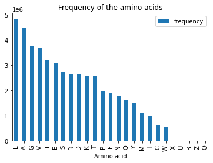
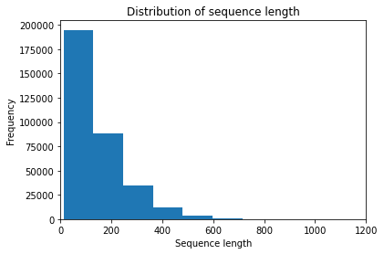
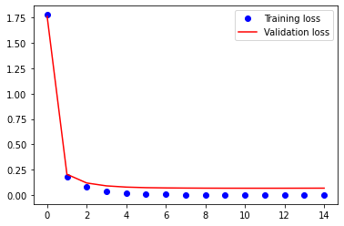
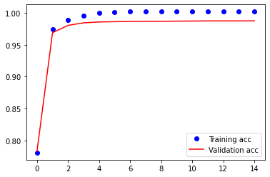

# Protein classifier: project overview
This project aims at building a model that assigns amino acid sequences to their protein family. The [Pfam dataset](https://www.kaggle.com/googleai/pfam-seed-random-split) is used for this task.  

I built a classifier that predicts to which family amongst the 429 most frequent protein families an amino acid sequence belongs. The classifier is a simple deep learning model with only 3 layers that yielded an accuracy of ~98% on the test set, which is better than the ~71% obtained with a decision tree classifier.  

## Resources
Python packages: Numpy, Pandas, Matplotlib, Sklearn, Keras    

## Data preprocessing and EDA

The Pfam database has 17929 protein families. Due to severe class imbalance, I focused on the protein families with more than 500 instances. This partial dataset has 429 unique protein families and 334045 instances.  
In the database, amino acids are encoded with a single alphabet. Below are a few figures describing the amino acid sequences whose protein families I wish to predict.

The data preprocessing consisted mainly in tokenizing, vectorizing and padding the amino acid sequences.  

## Classification

The data was split into training, validation and test sets.   

*Decision tree classifier*  

Validation accuracy: 0.71 , f1-score:0.70  

Test accuracy: 0.71, f1-score:0.69  

*Deep learning model*  

_________________________________________________________________

Layer (type)                 Output Shape              Param #   

=================================================================

embedding (Embedding)        (None, 100, 8)            176       

_________________________________________________________________

flatten (Flatten)            (None, 800)               0         

_________________________________________________________________

dense (Dense)                (None, 429)               343629    

=================================================================

*Test results*  

Accuracy: 0.985751  

Precision: 0.984994  

Recall: 0.984207  

F1 score: 0.984452  

 